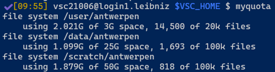
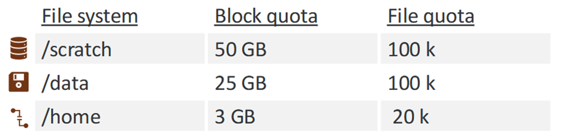
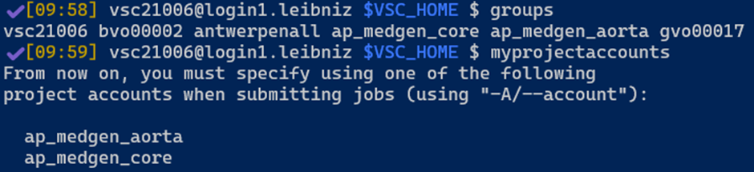
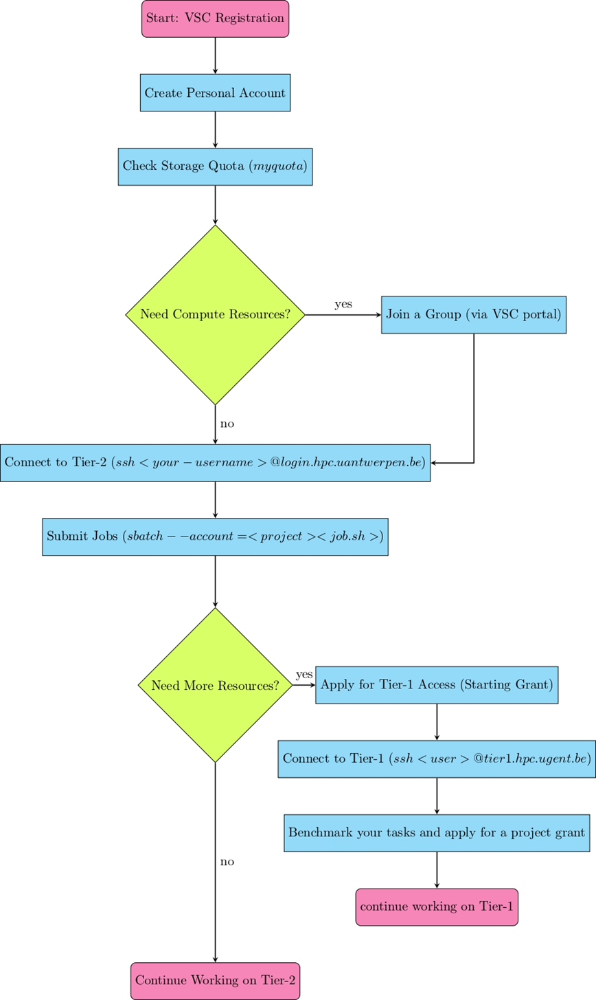

# VSC (Flemish Super Computer)
# Getting Started on the VSC (Tier-2 at UAntwerpen)

It is highly recommended to use the VSC. If you have questions about this, don’t hesitate to ask!

{:  .warning    }
>Read the documentation. The VSC is **not** long-term storage.

## Personal Account

1. Go to the VSC documentation and follow the steps under **"New VSC Account: UAntwerpen (AUHA)"** to set up your account.
2. If you have any issues, contact the system administrator.

With this account, you can store a limited number of files. Storage is subject to quotas, which you can check with:

```bash
myquota
```

This will show your current usage and available storage. For more details, visit Calcua.

* Overview of the quotas for storage on the Tier-2 VSC (Calcua website).



## Getting Compute Resources (Groups & Projects)

If you want to run computations, you need to be added to a group. Each group has projects with specific compute and storage allocations.

To check which groups and projects you have access to:

```bash
groups
myprojectaccounts
```

* Snapshot of the output of the `groups` command and the `myprojectaccounts` command on the VSC Tier-2.


If you need to be added to a group, contact your group leader or request access via the VSC account portal.

### Making a group

If you are a group leader, you can make a group via your personal account on the VSC with the button **"New/Join Group"**.

## Connecting to the UA Tier-2 Cluster

Once your account is set up, connect to the cluster via SSH:

```bash
ssh <your-username>@login.hpc.uantwerpen.be
```

To see available software modules:

```bash
module avail
```

To load a module:

```bash
module load <module-name>
```

To submit a job (make sure to specify the correct project):

```bash
sbatch --account=<project-name> <job-script.sh>
```

Monitor jobs with:

```bash
squeue -u <your-username>
```

For more details on working with SLURM and HPC systems, check the [Calcua documentation](https://www.uantwerpen.be/en/research-facilities/calcua/training/).

## Getting More Resources (Moving to Tier-1)

The Tier-2 cluster at Antwerp supports most workloads, but if you need more resources, you can apply for Tier-1 access (Hortense).

## Tier-1 Access & Grants

VSC Tier-1 resources require a grant. There are five types:

1. **Tier-1 Compute Starting Grant** (for optimizing pipelines)
   - Up to 500k core hours or 1,000 GPU hours
   - Maximum 8 months duration
   - Requests anytime, no deadlines
   - Free of charge

2. **Tier-1 Compute Grant** (for larger projects)
   - Between 500k – 7.5M core hours or 1k – 40k GPU hours
   - Duration: 8 months
   - Application deadlines: February, June, October

3. **Tier-1 Data Starting Grant**
   - Same resources as a full Tier-1 Data grant

4. **Tier-1 Data Grant**
   - Storage: 5 TiB – 1 PiB
   - Duration: 8 months – 4 years

5. **Tier-1 Compute Collaborative Grant** (for joint projects)
   - Up to 10M core hours or 75k GPU hours
   - Maximum 12 months duration
   - Requires at least three research groups from different institutions
   - Applications accepted on a rolling basis

## Applying for Tier-1 Access

- You must start with a Starting Grant before applying for a full project grant.
- Applications are submitted through the [VSC portal](https://account.vscentrum.be/){:  .btn}.
- Deadlines:
  - **Starting Grant:** Anytime
  - **Project Grant:** February, June, October

## Connecting to Tier-1 (Hortense)

Once approved, connect via SSH:

```bash
ssh <your-username>@tier1.hpc.ugent.be
```

Tier-1 also uses SLURM for job scheduling, so the commands are the same as Tier-2.

## More Information

- **VSC Documentation:** https://docs.vscentrum.be/
- **Calcua Training & HPC Courses:** https://www.uantwerpen.be/en/research-facilities/calcua/training/
- **VSC Compute Access & Grants:** https://www.vscentrum.be/compute

